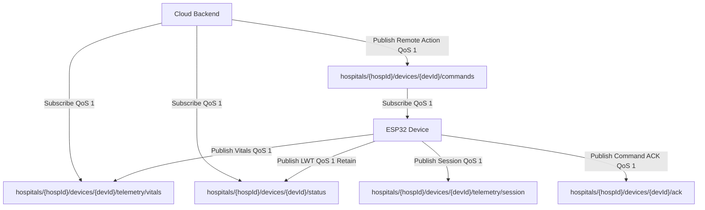
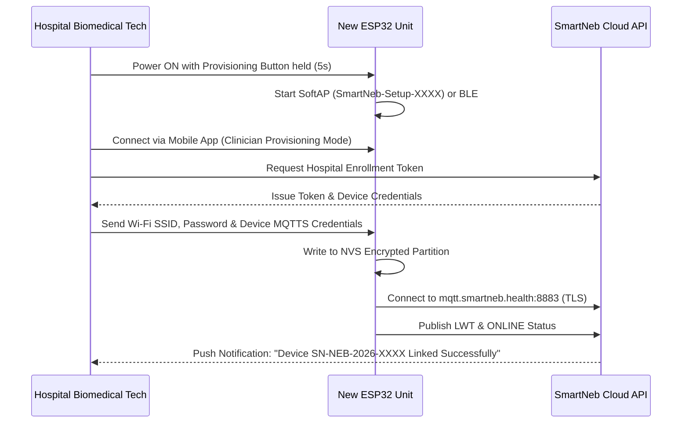

# ESP32 Firmware Specification & Hospital Provisioning Guide

**Target Hardware:** ESP32-WROOM-32 / ESP32-S3  
**Communication Protocol:** MQTT over TLS 1.3 (Port 8883)  
**Security Standard:** Per-Device Unique Credentials & Encrypted Non-Volatile Storage (NVS)  

---

## 1. Network & Broker Configuration Parameters

Every ESP32 unit deployed in the field requires the following configuration values stored in encrypted NVS:

| Configuration Parameter | Value / Format | Description |
| :--- | :--- | :--- |
| **Wi-Fi SSID** | Variable (Hospital / Home SSID) | Local 2.4 GHz Wi-Fi network |
| **Wi-Fi Password** | WPA2/WPA3 Pre-shared key | Encrypted in NVS |
| **MQTT Broker Host** | `mqtt.smartneb.health` | Publicly routable DNS hostname |
| **MQTT Port** | `8883` | TLS encrypted port (MQTTS) |
| **TLS CA Certificate** | Let's Encrypt ISRG Root X1 | Embedded in firmware flash |
| **Device Client ID** | `SN-NEB-2026-{SERIAL}` | Unique factory serial number |
| **MQTT Username** | `dev_SN-NEB-2026-{SERIAL}` | Unique device username |
| **MQTT Password** | Strong random 32-character hash | Provisioned during factory flash |
| **Hospital ID** | e.g., `hosp_apollo_01` | Assigned during hospital provisioning |

---

## 2. MQTT Topic Architecture & ACL Permissions

Topics are strictly segmented by `hospitalId` and `deviceId` to prevent cross-tenant message snooping:



### Topic Access Control List (ACL) Rules
- **Device Allowed Pub:**
  - `hospitals/{hospitalId}/devices/{deviceId}/telemetry/#`
  - `hospitals/{hospitalId}/devices/{deviceId}/status`
  - `hospitals/{hospitalId}/devices/{deviceId}/ack`
- **Device Allowed Sub:**
  - `hospitals/{hospitalId}/devices/{deviceId}/commands`
- **Backend Service Allowed:**
  - `hospitals/+/devices/+/telemetry/#` (Sub)
  - `hospitals/+/devices/+/status` (Sub)
  - `hospitals/+/devices/+/ack` (Sub)
  - `hospitals/+/devices/+/commands` (Pub)

---

## 3. Telemetry Payload Schemas

### 3.1 Live Vitals Payload (`telemetry/vitals`)
Published every 1000 ms during an active nebulization session:
```json
{
  "deviceId": "SN-NEB-2026-0042",
  "hospitalId": "hosp_apollo_01",
  "patientId": "pt_9824",
  "timestamp": 1775174400,
  "vitals": {
    "spo2": 97,
    "pulseRate": 104,
    "respiratoryRate": 24,
    "fingerDetected": true
  },
  "deviceStatus": {
    "meshState": "ACTIVE",
    "chamberLevelMl": 3.8,
    "batteryPercent": 84,
    "temperatureC": 36.4
  }
}
```

### 3.2 Last Will and Testament (LWT) (`status`)
Configured on MQTT client connect:
- **Topic:** `hospitals/{hospitalId}/devices/{deviceId}/status`
- **Retain:** `true`, **QoS:** `1`
- **Online Payload:** `{"status": "ONLINE", "uptimeSec": 420}`
- **Offline (LWT) Payload:** `{"status": "OFFLINE", "reason": "UNEXPECTED_DISCONNECT"}`

### 3.3 Command Dispatch & ACK Schemas
- **Command (`commands`):**
  ```json
  {
    "commandId": "cmd_817294",
    "idempotencyKey": "idem_1775174400_abc",
    "action": "START_TREATMENT",
    "flowRatePercent": 80,
    "durationSeconds": 600
  }
  ```
- **Acknowledgment (`ack`):**
  ```json
  {
    "commandId": "cmd_817294",
    "status": "EXECUTED",
    "errorCode": null,
    "timestamp": 1775174402
  }
  ```

---

## 4. Hospital Device Provisioning Workflow



### Step-by-Step Provisioning Procedure
1. **Factory Flash:**
   - Flash device with production firmware (`bootloader.bin`, `partition-table.bin`, `smartneb_firmware.bin`).
   - Write unique Device Serial Number and factory MQTT credentials into NVS.
2. **Hospital Handover:**
   - Biomedical engineer opens the SmartNeb Clinician Mobile App.
   - Selects **"Provision Hardware Device"**.
   - App scans Bluetooth Low Energy (BLE) advertisement `SmartNeb-PROV-XXXX`.
   - Selects hospital department and enters hospital Wi-Fi network credentials.
   - App calls `POST /api/v1/devices/provision` to register device serial to the hospital's tenant ID in the cloud database.
   - App pushes Wi-Fi credentials and assigned `hospitalId` over BLE to the ESP32.
   - ESP32 reboots, connects to hospital Wi-Fi, initiates TLS 1.3 handshake with `mqtt.smartneb.health:8883`, and issues its first `ONLINE` status packet.
